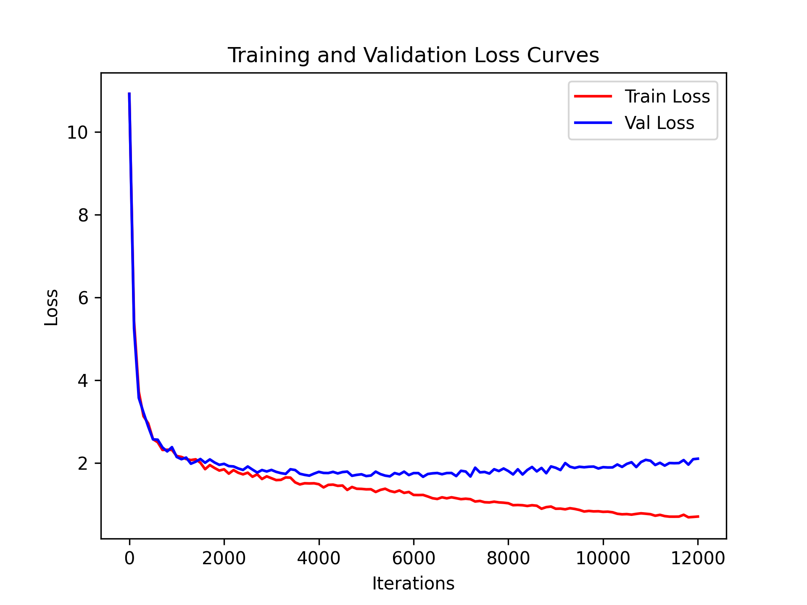

# Poly-FNN nanoGPT

This repository is a GPT-style language model implementation that replaces the usual Transformer MLP with a custom polynomial feed-forward network, or **PolyFFN**.

The main idea is simple:

- keep the attention block unchanged
- replace the feed-forward layer with a polynomial feature expansion
- stabilize the new polynomial parameters with extra gradient control during training

The result is a compact implementation that is still easy to read, but now highlights how the Poly-FNN block is built and trained.

## Contents

- [What Changed](#what-changed)
- [PolyFFN Design](#polyffn-design)
- [How It Is Wired Into GPT](#how-it-is-wired-into-gpt)
- [Training Stabilization](#training-stabilization)
- [Loss Curve](#loss-curve)
- [How To Run](#how-to-run)
- [Key Files](#key-files)

## What Changed

The original GPT block uses:

- layer norm
- causal self-attention
- a standard MLP with GELU

In this version, the MLP is replaced by `PolyFFN` in [`model.py`](model.py). The attention path stays the same, so the architectural change is isolated to the feed-forward sub-layer.

That makes the implementation easy to study:

- the attention block still handles token interaction
- the PolyFFN block handles feature mixing with polynomial terms
- the training loop adds targeted stabilization for the polynomial parameters

## PolyFFN Design

The `PolyFFN` module lives in [`model.py`](model.py). It builds three parallel feature lanes from the same input tensor:

```python
x1 = x
x2 = x ** 2
x3 = x ** 3
```

Each lane has its own linear projection:

```python
out1 = poly_layer_1(x1)
out2 = poly_layer_2(x2)
out3 = poly_layer_3(x3)
```

There is also a learnable vector coefficient:

```python
psi_alpha = torch.tanh(alpha)
```

The outputs are summed:

```python
f_poly = out1 + out2 + out3 + psi_alpha
```

and then projected back to the residual dimension:

```python
return proj(f_poly)
```

### Why this structure

This implementation gives the network access to polynomial feature interactions without introducing a separate explicit basis expansion layer. In practice:

- `x` keeps the linear signal
- `x ** 2` captures quadratic effects
- `x ** 3` captures cubic effects
- `alpha` adds a learned per-channel offset, with `tanh` keeping it bounded

The design is intentionally small and direct, so each part of the polynomial pathway is easy to inspect.

## How It Is Wired Into GPT

In the standard GPT block, the MLP path is replaced here:

```python
self.mlp = PolyFFN(config)
```

The full block still follows the usual residual structure:

```python
x = x + self.attn(self.ln_1(x))
x = x + self.mlp(self.ln_2(x))
```

So the model keeps the familiar Transformer skeleton:

- token and position embeddings
- stacked blocks
- final layer norm
- tied token embedding and language modeling head

Only the feed-forward module changes.

## Training Stabilization

The polynomial parameters are more sensitive than a standard MLP, so [`train.py`](train.py) adds a targeted stabilizer before the optimizer step.

The helper function is:

```python
apply_local_polynomial_stabilizers(model, gamma=0.5, tau=1.0, beta=1.0)
```

It looks for parameters whose names contain:

- `poly_layer`
- `alpha`

For those parameters, it applies two controls:

1. Constant gradient scaling
   - multiply the gradient by `gamma`
2. Exponential dampening when the local gradient norm exceeds `tau`
   - reduce large updates with a smooth decay term controlled by `beta`

After that, the code still applies global gradient clipping:

```python
torch.nn.utils.clip_grad_norm_(model.parameters(), grad_clip)
```

So the update path is:

1. backward pass
2. unscale gradients
3. stabilize polynomial parameters locally
4. clip global norm
5. optimizer step

This is the most important implementation detail beyond the PolyFFN module itself.

## Loss Curve

The file [`loss_curve.png`](loss_curve.png) shows the training and validation behavior of this implementation.



How to read it:

- training loss falls steadily as the model fits the data
- validation loss drops early, then flattens
- a widening gap between train and validation loss suggests overfitting

If the curve looks unstable, the first things to check are:

- learning rate
- gradient clipping
- the polynomial stabilizer settings
- model size and block size

## How To Run

### Install

```sh
pip install torch numpy transformers datasets tiktoken wandb tqdm
```

### Prepare data

For a quick smoke test:

```sh
python data/shakespeare_char/prepare.py
```

### Train

```sh
python train.py config/train_shakespeare_char.py
```

### Sample

```sh
python sample.py --out_dir=out-shakespeare-char
```

### CPU example

If you want a smaller and faster CPU run:

```sh
python train.py config/train_shakespeare_char.py --device=cpu --compile=False --eval_iters=20 --log_interval=1 --block_size=64 --batch_size=12 --n_layer=4 --n_head=4 --n_embd=128 --max_iters=2000 --lr_decay_iters=2000 --dropout=0.0
```

## Key Files

- [`model.py`](model.py) defines the GPT model and the `PolyFFN` block
- [`train.py`](train.py) contains the training loop and polynomial gradient stabilizers
- [`sample.py`](sample.py) runs inference from a trained checkpoint
- [`config/train_shakespeare_char.py`](config/train_shakespeare_char.py) is the smallest example configuration
- [`loss_curve.png`](loss_curve.png) shows the training behavior of the current setup

## Notes

This README is focused on the Poly-FNN implementation rather than the original nanoGPT project overview.

If you want, I can also rewrite the code comments in `model.py` and `train.py` so they match this README more closely.
